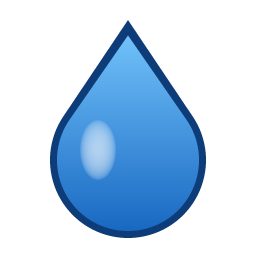

# Blue Droplets

**Blue Droplets** adds a thirst bar and water purity to Minecraft, built to fit modpacks: it works with many popular mods and aims to be highly configurable, with sensible defaults.

It is the continuation of **[Thirst Was Taken](https://github.com/ghen-git/Thirst-Mod)** by **ghen**, released under the MIT license. Existing Thirst Was Taken worlds and configs are migrated automatically (see below).

> The current logo is a **temporary placeholder** (see [art/README.md](art/README.md)) and will be replaced by artwork from a human artist.

## Features

- Thirst bar next to the hunger bar, with a hidden "quenched" value (like saturation). Thirst drains with activity and hot biomes; at zero you take damage.
- Water purity in four levels (dirty, slightly dirty, acceptable, purified) on buckets, bottles, bowls, fluids and cauldrons. Drinking impure water can make you sick.
- Purify water by smelting or campfire cooking, or with Create's Sand Filter.
- Drink directly from water sources by hand.
- Terracotta and clay bowls as early-game water containers.
- `/bluedroplets` command (`/thirst` still works) to query or set thirst.

## Moving from Thirst Was Taken

Blue Droplets uses the mod id `bluedroplets` and cannot be installed together with Thirst Was Taken or Thirst Was Reclaimed (mod id `thirst`); the game will tell you if both are present.

- **Worlds**: items, blocks, effects, thirst data and purity saved with `thirst:` ids load under `bluedroplets:` ids. Nothing needs to be done.
- **Config**: on first start, `config/thirst/` is copied to `config/bluedroplets/` and its files are split by concern (`gameplay.toml`, `purity.toml`, `items.toml`, `compat.toml`, `client.toml`; see `wiki/Configuration.md`). Modpacks shipping `defaultconfigs/thirst/` should rename it to `defaultconfigs/bluedroplets/` and use the new file names.
- **Datapacks and resource packs** that target `thirst:` ids or translation keys need to be updated to `bluedroplets:`.

## Compatibility

Current (1.21.1, all optional):

- Create 6.0.6+ (Sand Filter, purity kept through pumps, tanks and basins, Ponder scene)
- Jade (purity in fluid tooltips)
- Farmer's Delight Nourishment, Let's Do Bakery's Stuffed, Let's Do Brewery's Saturated and Tombstone's ghostly shape pause thirst drain
- Farmer's Delight, Brewin' and Chewin', Farmer's Respite (drinks and loot)
- Farmer's Delight Nourishment, Let's Do Bakery's Stuffed and Let's Do Brewery's Saturated effects slow thirst; Tombstone's ghostly shape pauses it
- Cold Sweat (body temperature drives thirst)
- Vampirism and Supernatural (vampires do not get thirsty)

Incompatible: Tough As Nails (it has its own thirst system).

Planned: Create fan purification, the wider Farmer's Delight ecosystem, Traveler's Backpack, Serene Seasons, JEI/EMI purification pages, Reliquary, Curios canteen slot, and a public API for other mods.

## Versions

Development happens on Minecraft 1.21.1 (NeoForge) first. Ports follow, each one once the previous version is stable:

1. 1.21.1 (NeoForge) - current
2. 26.3 (NeoForge)
3. 1.20.1 (one jar for Forge and NeoForge)
4. 1.19.2 (Forge)
5. 1.18.2 (Forge)
6. 1.12.2 (Forge)
7. 1.7.10 (Forge)

## Links

- [Changelog](CHANGELOG.md)
- Wiki: coming soon
- [Issues](https://github.com/Darkona/blue-droplets/issues)

## Credits and license

- **ghen** created Thirst Was Taken; this mod is built on its code.
- **mlus-asuka** and the other Thirst Was Taken contributors ported and maintained it for 1.21.
- **Mikul** ([MikulDev](https://github.com/MikulDev)), author of Cold Sweat, made the NeoForge 1.21.1 port this mod starts from and kept the Cold Sweat integration working.
- Maintained by **Darkona**.

Blue Droplets is released under the [MIT license](LICENSE), which keeps the original Thirst Was Taken copyright notice.
